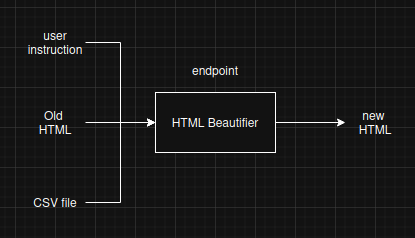
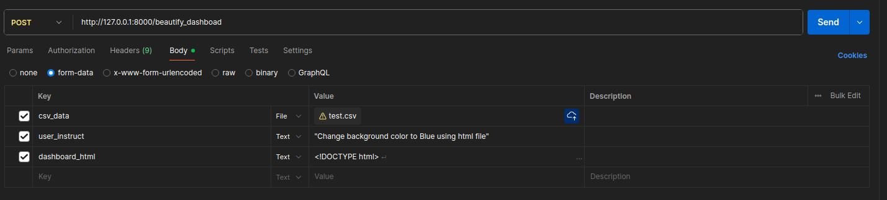
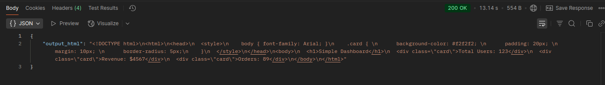

# Dynamic Dashboard
Built API which update HTML content of dashboard, according to  user instruction, CSV, and HTML for dashboard.

## API Block diagram



## To Run
- install requirements using following command
```
pip install -r requirements.txt
```
- run api using following command
```
uvicorn main:app --reload
```
## Input API


## Output API

